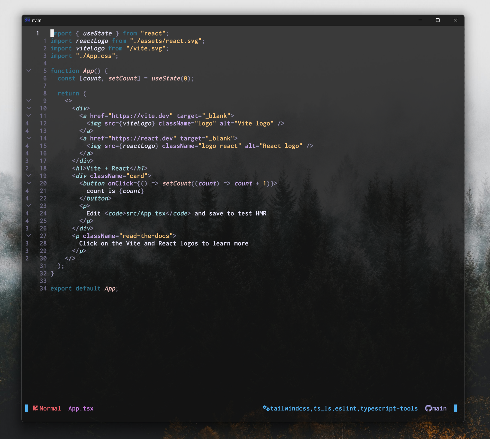

# Neovim Configuration [](https://github.com/neovim/neovim)

Welcome to my Neovim configuration!
This setup is designed to make development smoother and more efficient,
with a focus on full-stack development, (frontend via JavaScript, TypeScript,
and React & backend via Golang and Ruby) while leveraging a powerful LSP setup,
custom UI enhancements, and cross-platform consistency.

<br/>



## 📁 Folder Structure

The configuration is structured for easy navigation and extensibility:

```plaintext
~/.config/nvim/
├── init.lua                  # Main Neovim configuration file
├── lua/
│   ├── config/
│   │   └── lazy.lua          # Main Lazy config
│   ├── core/
│   │   ├── autocommand.lua
│   │   ├── options.lua       # General options
│   │   └── keymaps.lua       # Generic keymaps to make experience better
│   ├── lsp/
│   │   ├── init.lua          # Main LSP configurations
│   │   ├── setup.lua         # Generic setup functions for LSP
│   │   └── servers/          # Folder for individual server configurations
│   │       ├── ts_ls.lua     # TypeScript LSP configuration
│   │       ├── gopls.lua     # Golang LSP configuration
│   │       └── ...
│   ├── plugins/              # Plugin configurations and setup
│   ├── utils/                # Helper functions
│   └── ui/                   # Custom Icons and other ui items
└── README.md
```

## 💻 Installation

### Prerequisites

- [git](https://git-scm.com/) ≥ 2.19.0
- [Neovim](https://github.com/neovim/neovim/wiki/Installing-Neovim) ≥ v0.10.0

**Optional**, but highly recommended:

- [bat](https://github.com/sharkdp/bat)
- [fd](https://github.com/sharkdp/fd)
- [fzf](https://github.com/junegunn/fzf)
- [ripgrep](https://github.com/BurntSushi/ripgrep)

### Install

1. Let's clone this repo! Clone to `~/.config/nvim`

```bash
mkdir -p ~/.config
```

```bash
git clone git@github.com:Tecu23/nvim-config.git ~/.config/nvim
```

```bash
cd ~/.config/nvim
```

2. Run `nvim` (will install all plugins the first time).

It's highly recommended running `:checkhealth` to ensure your system is healthy
and meet the requirements.

## ✔️ Features

- **Plugin Management**: Efficiently manage plugins with [lazy.nvim](https://github.com/folke/lazy.nvim).
- **Enhanced Searching**: Improve searching with [flash.nvim](https://github.com/folke/flash.nvim).
- **LSP Integration**: Full support for JavaScript, TypeScript, and many more with
  language server configurations with[nvim-lspconfig](https://github.com/neovim/nvim-lspconfig).
- **Autocompletion**: Experience intelligent autocompletion with [nvim-cmp](https://github.com/hrsh7th/nvim-cmp).
- **Auto-Formatting**: Automatically format code and
  organize imports on save using `conform.nvim` and `typescript-tools`.
- **Formatting**: Keep your code clean with [conform.nvim](https://github.com/stevearc/conform.nvim).
- **Syntax Highlighting**: Enjoy enhanced syntax highlighting with [nvim-treesitter](https://github.com/nvim-treesitter/nvim-treesitter).
- **Fuzzy Finding**: Find files and more with ease using [telescope.nvim](https://github.com/nvim-telescope/telescope.nvim).
- **Integrated Terminal**: Access a terminal within Neovim using [toggleterm.nvim](https://github.com/akinsho/toggleterm.nvim).
- **Git Integration**: Effortlessly manage Git repositories
  with [gitsigns.nvim](https://github.com/lewis6991/gitsigns.nvim) and [lazygit](https://github.com/jesseduffield/lazygit).
- **Markdown Preview**: Preview your Markdown files with [markdown-preview.nvim](https://github.com/iamcco/markdown-preview.nvim).

## ✨ Contributing

If you find anything that needs improving, do not hesitate to
point it out or create a PR.
